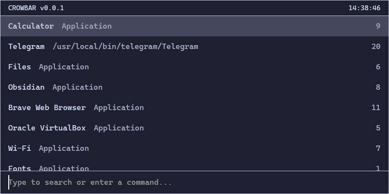

<div align="center">

</div>
<h1 align="center">Crowbar</h1>
<p align="center"><i>A fast, minimal and smart application launcher for Linux</i></p>
<div align="center">
</div>
</h1>

[](https://github.com/mxschll/crowbar/actions/workflows/build.yml)

> **Prototype**: Crowbar is currently a prototype. While it's functional, you
> may encounter bugs, and features might change in the future.

Created out of love for dmenu's simplicity, but built for Wayland systems where
dmenu can be buggy.



## Features

- Written in Rust (btw)
- Single binary - drop it anywhere and run
- Lightning-fast launches
- Smart suggestions that basically read your mind (based on usage patterns and time of day)
- Customizable to your heart's content

## Installation & Setup

These instructions are written for Ubuntu, but should apply to most Linux
distributions.

1. Download the latest Crowbar binary from the [releases page](https://github.com/mxschll/crowbar/releases)

2. Install the binary:

   ```bash
   # Create the bin directory if it doesn't exist
   mkdir -p ~/.local/bin
   
   # Move the binary to your local bin directory
   mv crowbar ~/.local/bin/
   
   # Make it executable
   chmod +x ~/.local/bin/crowbar
   ```

3. Set up the keyboard shortcut in Ubuntu:
   1. Open System Settings
   2. Go to `Keyboard` settings
   3. Click on `View and Customize Shortcuts`
   4. Select `Custom Shortcuts`
   5. Click the `+` button to add a new shortcut
   6. Fill in the following:
      - Name: `Crowbar`
      - Command: `/home/YOUR_USERNAME/.local/bin/crowbar` (replace YOUR_USERNAME with your actual username)
      - Shortcut: Press your desired key combination (e.g., Super + Space)

Now you can launch Crowbar anytime by pressing your chosen keyboard shortcut!

> Note: Make sure to use the absolute path in the command field. For example, if your username is "john",
> the command should be `/home/john/.local/bin/crowbar`

## Navigation

### Keyboard Controls

| Action | Keys |
|--------|------|
| Open Launcher | User-configured shortcut |
| Close | `Escape` |
| Navigate Down | `↓` or `Ctrl+N` or `Ctrl+J` or `Tab` |
| Navigate Up | `↑` or `Ctrl+P` or `Ctrl+K` or `Ctrl+Tab` |

## Configuration

Crowbar can be configured through a TOML file located at
`~/.config/crowbar/crowbar.toml`. The configuration file will be
automatically created with default values on first run.

### Available Options

```toml
# Window dimensions (in pixels)
window_width = 800.0
window_height = 400.0


# Font settings
font_family = "Liberation Mono"
font_size = 16.0


# Colors
text_primary_color = "#cdd6f4"            # Main text color
text_secondary_color = "#a6adc8"          # Secondary text color (e.g., descriptions)
text_selected_primary_color = "#cdd6f4"   # Selected item main text color
text_selected_secondary_color = "#a6adc8" # Selected item secondary text color
background_color = "#1e1f2f"              # Main background color
border_color = "#bac2de"                  # Window border color
selected_background_color = "#45475a"     # Selected item background color


# Status bar configuration - each section can contain multiple items
[[status_bar_left]]
type = "text"
content = "Crowbar"

[[status_bar_center]]
type = "datetime"
format = "%I:%M:%S %p"

[[status_bar_right]]
type = "datetime"
format = "%Y-%m-%d"

[[status_bar_right]]
type = "text"
content = "v1.0"
```

All colors must be specified in hex format with a leading `#` followed by 6
characters.

The `font_family` setting accepts any font name installed on your system. Make
sure the specified font is installed and supports monospace rendering for best
results.

For the status bar configuration, you can customize each section with multiple items:

- `type = "text"` - Static text content specified in the `content` field
- `type = "datetime"` - Dynamic date/time that uses the format specified in the `format` field
  (follows [strftime format](https://docs.rs/chrono/latest/chrono/format/strftime/index.html))

Examples of datetime formats:

- `%H:%M:%S` - 24-hour time with seconds (e.g., 13:45:30)
- `%I:%M %p` - 12-hour time with AM/PM (e.g., 01:45 PM)
- `%a %b %d` - Abbreviated weekday, month and day (e.g., Mon Jan 01)
- `%Y-%m-%d` - Full date in ISO format (e.g., 2023-01-01)

You can combine multiple items in each section, and they will be displayed with a small gap between them.

If the configuration file becomes corrupted or contains invalid values, Crowbar will override it with the default values.
