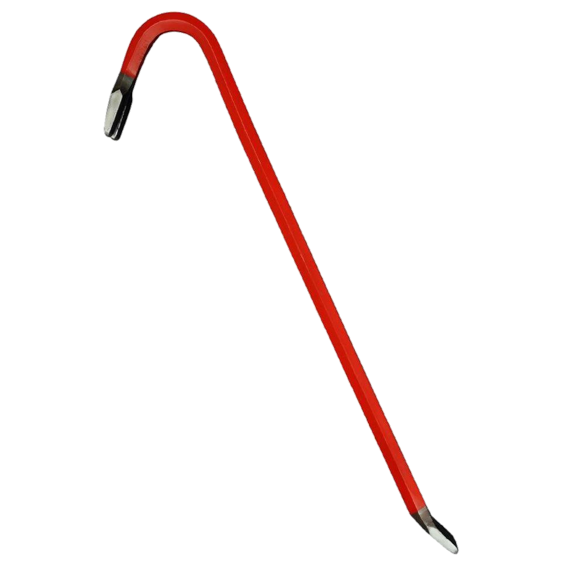

<div align="center">

</div>
<h1 align="center">Crowbar - The <i>Fastest</i> Launcher<br />
<div align="center">
</div>
</h1>

Linux application launcher. Much fast. Much in alpha, so things might break.


## Installation & Setup

These instructions are written for Ubuntu, but should apply to most Linux
distributions.

1. Download the latest Crowbar binary from the [releases page](https://github.com/mxschll/crowbar/releases)

2. Install the binary:
   ```bash
   # Create the bin directory if it doesn't exist
   mkdir -p ~/.local/bin
   
   # Move the binary to your local bin directory
   mv crowbar ~/.local/bin/
   
   # Make it executable
   chmod +x ~/.local/bin/crowbar
   ```

3. Set up the keyboard shortcut in Ubuntu:
   1. Open System Settings
   2. Go to `Keyboard` settings
   3. Click on `View and Customize Shortcuts`
   4. Select `Custom Shortcuts`
   5. Click the `+` button to add a new shortcut
   6. Fill in the following:
      - Name: `Crowbar`
      - Command: `/home/YOUR_USERNAME/.local/bin/crowbar` (replace YOUR_USERNAME with your actual username)
      - Shortcut: Press your desired key combination (e.g., Super + Space)

Now you can launch Crowbar anytime by pressing your chosen keyboard shortcut!

> Note: Make sure to use the absolute path in the command field. For example, if your username is "john", 
> the command should be `/home/john/.local/bin/crowbar`

## Navigation

### Keyboard Controls

| Action | Keys |
|--------|------|
| Open Launcher | User-configured shortcut |
| Close | `Escape` |
| Navigate Down | `↓` or `Ctrl+N` or `Ctrl+J` |
| Navigate Up | `↑` or `Ctrl+P` or `Ctrl+K` |

## Configuration

Crowbar can be configured through a TOML file located at
`~/.config/crowbar/crowbar.config`. The configuration file will be
automatically created with default values on first run.


### Available Options

```toml
# Window dimensions (in pixels)
window_width = 800.0
window_heigth = 400.0

# Font settings
font_family = "Liberation Mono"
font_size = 16.0

# NOT IMPLEMENTED YET Colors (in hex format) [
background = "#c5c8c6"            # Main background color
foreground = "#1d1f21"            # Main text color
selection_foreground = "#ffffff"  # Selected text color
selection_background = "#373b41"  # Selection highlight color
border_color = "#81a2be"          # Inactive window border
active_border_color = "#373b41"   # Active window border
```

All colors must be specified in hex format with a leading `#` followed by
exactly 6 characters (e.g., "#c5c8c6"). The colors support standard RGB hex
values.

The `font_family` setting accepts any font name installed on your system. Make
sure the specified font is installed and supports monospace rendering for best
results.

If the configuration file becomes corrupted or contains invalid values, Crowbar
will automatically reset it to default values.

